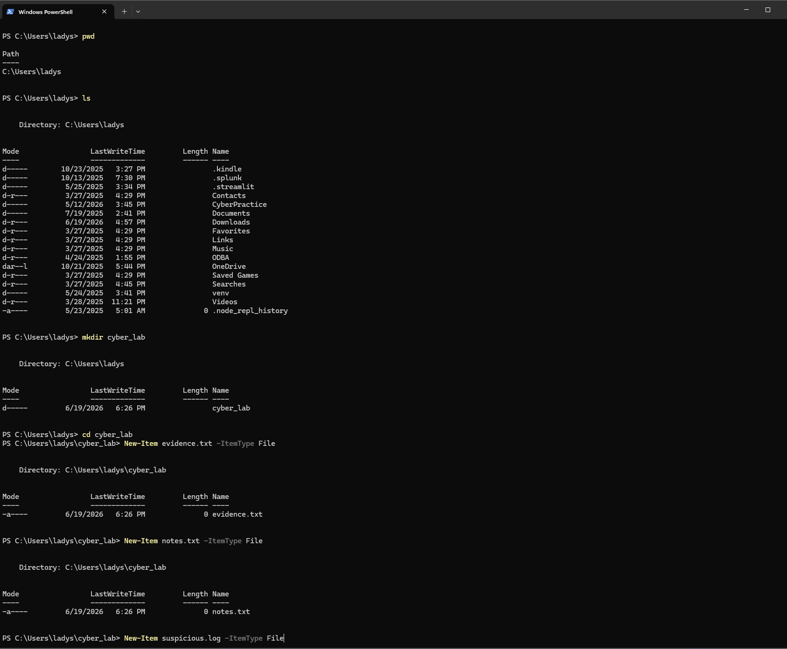
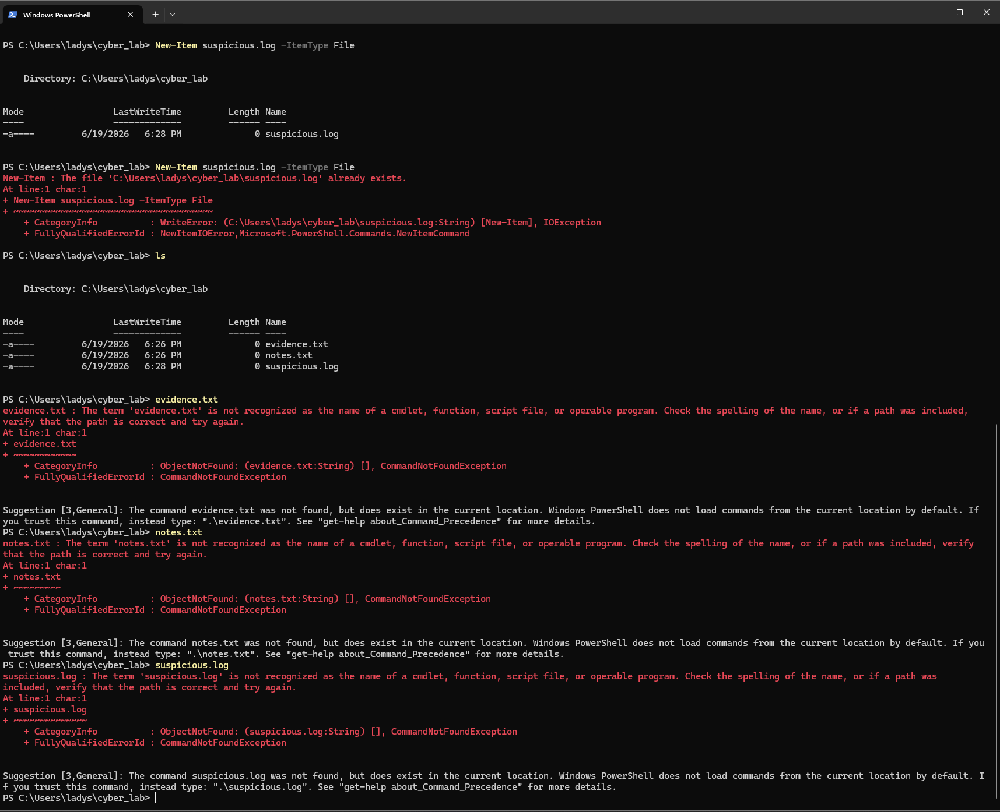
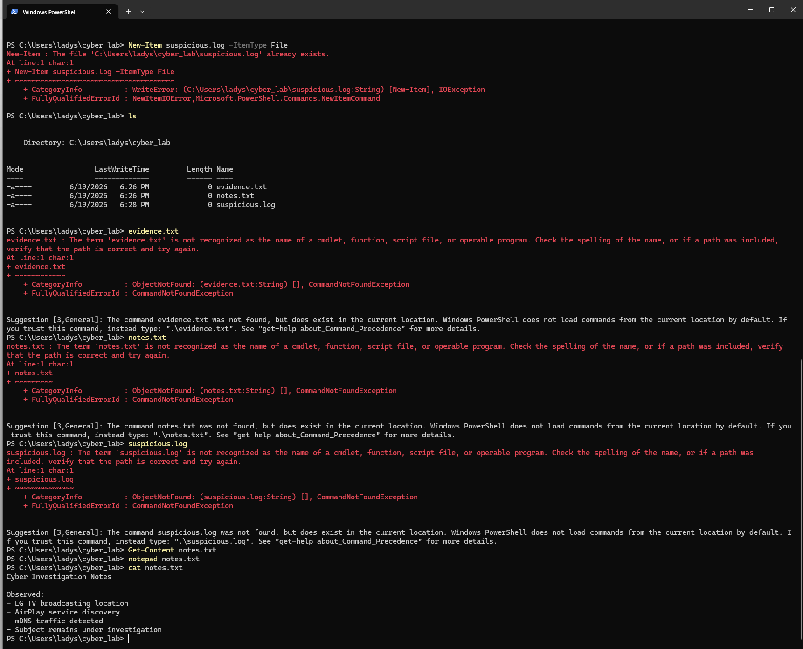
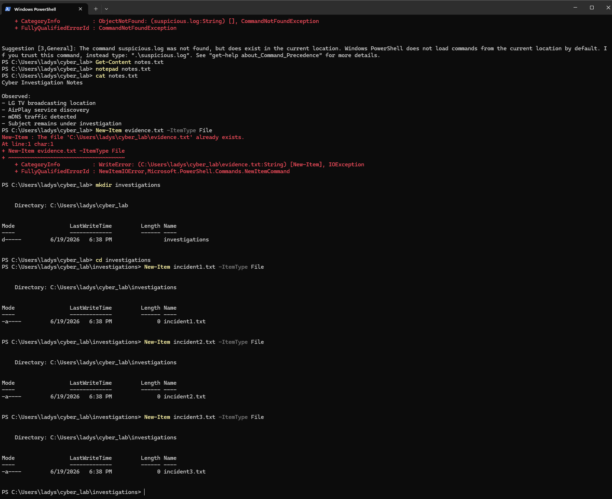
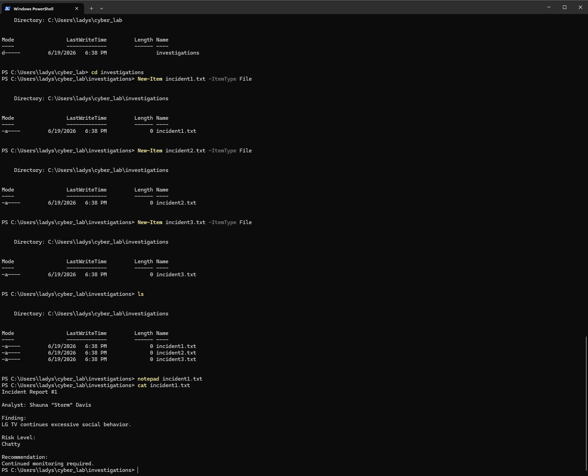

# Incident Response PowerShell Lab

## Overview

This hands-on lab demonstrates foundational PowerShell skills used in cybersecurity and IT operations.

The objective was to practice navigating directories, creating files, documenting findings, managing evidence, and troubleshooting errors using only the command line.

---

## Skills Practiced

* PowerShell navigation
* Directory creation
* File creation
* File editing
* File verification
* Incident documentation
* Evidence management
* Cybersecurity reporting
* Troubleshooting and problem solving

---

## Commands Used

```powershell
mkdir investigations
cd investigations

New-Item incident1.txt -ItemType File
New-Item incident2.txt -ItemType File
New-Item incident3.txt -ItemType File

ls

notepad incident1.txt

Get-Content incident1.txt
```

---

## Investigation Scenario

During a Wireshark network traffic investigation, unusual mDNS broadcasts were observed originating from an LG Smart TV on the local network.

The device repeatedly advertised AirPlay services and broadcast information identifying its location as the living room. This activity was documented as part of a simulated incident response investigation.

---

## Findings

* LG Smart TV repeatedly announced itself using mDNS
* AirPlay services were advertised on the local network
* Device location information was visible in network broadcasts
* Evidence was documented using PowerShell-created incident files

---

## Lessons Learned

This lab reinforced several important cybersecurity concepts:

* Command-line proficiency is essential for cybersecurity professionals
* Documentation is a critical part of incident response
* Smart devices generate significant background network traffic
* PowerShell can be used to organize investigations and evidence
* Troubleshooting errors is a normal part of learning technical skills

---

## Errors Encountered

During this lab I attempted to open files by typing:

```text
evidence.txt
notes.txt
suspicious.log
```

PowerShell returned CommandNotFound errors because it interpreted the filenames as commands rather than files.

---

## Resolution

I learned to use:

```powershell
Get-Content filename.txt
```

to read file contents and:

```powershell
notepad filename.txt
```

to edit files.

This troubleshooting process helped reinforce how PowerShell handles commands versus files.

---

# Screenshots

## Creating Files and Evidence



## Troubleshooting PowerShell Errors



## Reviewing Investigation Notes



## Creating Incident Reports



## Final Investigation Findings



---

## Author

**Shauna "Storm" Davis**

Cyber & Data Security Technology Student

Future CISO | Cybersecurity Enthusiast | Lifelong Learner

